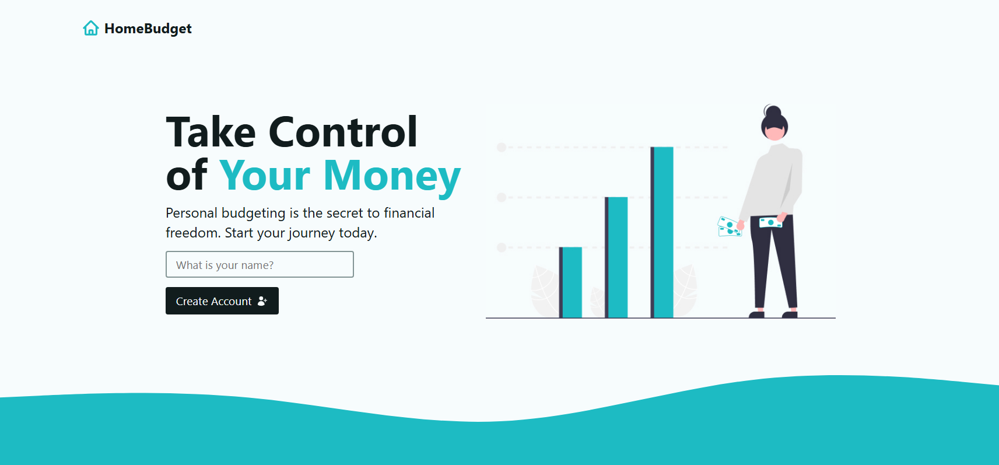
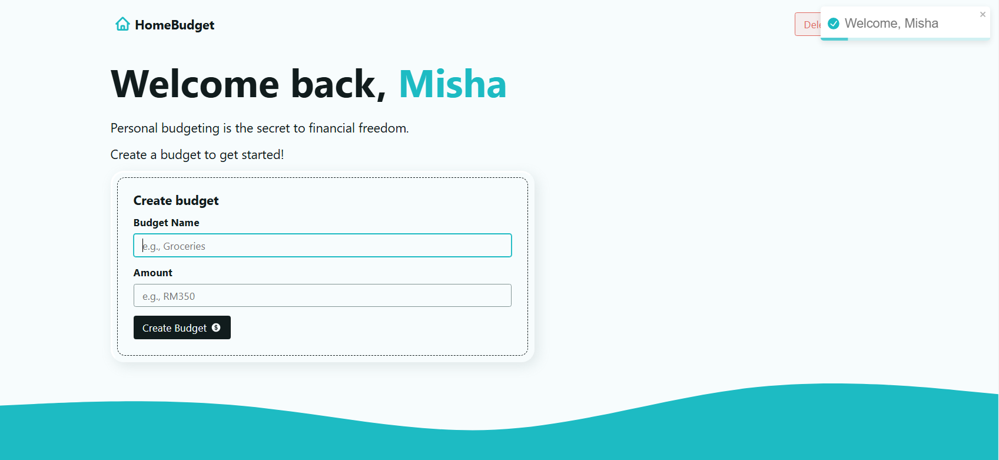

# React Personal Budget App

This small web application is made with React Router, utilizing its useful components and functions to create seamless navigation between pages and loading of local states.

## 🚀 Features
- Create and delete user
- Add and remove new budget
- Add and remove new expenses to and from budgets
- View budget details page
- View list of recent expenses
- Notifications for actions

## 🖼️ Screenshots
#### Landing Page


#### Home Page 


#### Adding Budgets & Expenses


#### Viewing Budget Page


## 📌 How to Use

1. Clone the repository  
   ```sh
   git clone https://github.com/your-username/your-repo.git
2. Navigate to project directory
    ```sh
    cd your-repo
3. Install dependencies
    ```sh
    npm install
4. Start development server
    ```sh
    npm run dev

## 📞 Contact Me

- 💼 [LinkedIn](https://www.linkedin.com/in/misha-chee/)  
- 🌐 [Personal Website](https://mishaisawesome.github.io/portfolio/)  
